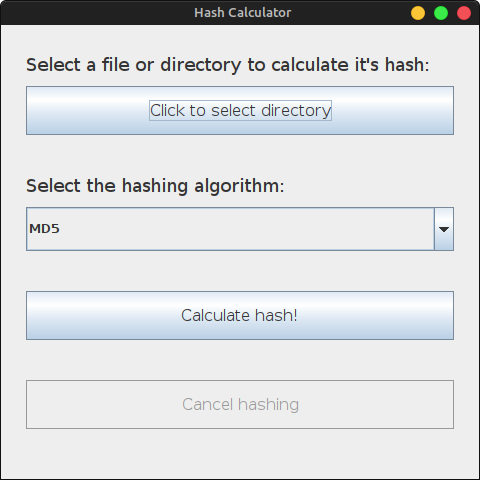
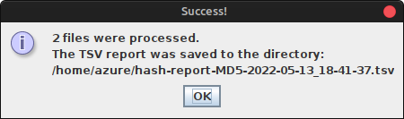

# Hash Calculator

This project was built for the Security and Data Criptography subject in my Computer Science course.

It was written in Java and is composed of a GUI to calculate MD5, SHA-1 and SHA-256 hashes of multiple files.

You can download the latest release [here](https://github.com/rhian-cs/puc-2021-2-java-hash-calculator/releases/latest).

## Screenshots

In the main window you can select the directory that you wish to calculate the files' hash:



After pressing on the `Calculate hash!` button, a file will be generated and this message will show up:



The generated file contains a TSV report (table separated), which will look like this:

| File                                | MD5 Hash                         |
| ----------------------------------- | -------------------------------- |
| /tmp/test                           |                                  |
| /tmp/test/comandosADBUniversais.pdf | 2762c703d6cf917691e6264c2dee0033 |

## Building the Application

No IDE was used to create this project, I've only used VS Code and built everything manually with `javac`.

Dependencies (check if the following commands are available):

- java
- javac
- jar

### Building on Linux:

You can build the application with the shell script:

```console
$ ./build.sh
```

You can then run the application with:

```console
$ java -jar build/HashCalculator.jar
```

Or double-click it through the GUI.

### Building on Windows

You can try to convert the build.sh script into a batch script, or run the following commands on cmd:

**Warning: This was NOT YET TESTED.**

```console
javac -d build Main.java gui\GlobalState.java gui\components\FileSelector.java gui\DefaultWindow.java gui\MainPanel.java gui\workers\DirectoryHashWorker.java gui\MainWindow.java gui\DefaultPanel.java hash_calculators\FileHashCalculator.java

cd build

jar cvfm HashCalculator.jar ..\META-INF\MANIFEST.MF Main.class Main$1.class gui\MainPanel.class gui\components\FileSelector.class gui\GlobalState.class gui\workers\DirectoryHashWorker.class gui\MainWindow.class gui\DefaultPanel.class gui\DefaultWindow.class hash_calculators\FileHashCalculator.class

cd ..
```

Then run the application with:

```console
java -jar build\HashCalculator.jar
```
